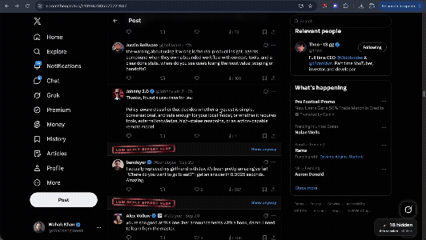

# Reply Guy Repellent

Hides low-effort replies on X so you only see the real ones.

Every viral post ends the same way: 300 replies, 40 of them worth reading. This stamps the rest.



## How it works

Two passes, so it feels instant and stays cheap.

1. **Keyword pass** runs in your browser with no network call. Emoji-only replies, "great insight", "so true, thanks for sharing", and friends get stamped immediately.
2. **Smart pass** handles everything the keyword list can't judge. Each borderline reply goes to [Jev](https://typesafe.ai) by TypeSafe, a fast decision model, which scores how generic it is. Anything above your strictness setting gets stamped.

The smart pass runs on a scorer you deploy yourself, which takes about five minutes: see [Set up scoring](#set-up-scoring). Skip it and the keyword pass still does most of the work, with zero network calls.

Stamped replies aren't deleted. They collapse to a bar with a "Show anyway" link, and once you reveal one it stays revealed.

No X API, no login, no scraping. The extension only reads the page already open in your browser.

## Install

> **Install manually for now:** The extension is not in the Chrome Web Store yet (review in progress). Follow these steps to install it directly:

1. Download the latest zip from [Releases](../../releases) and unzip it.
2. Open `chrome://extensions` and turn on **Developer mode**, top right.
3. Click **Load unpacked** and pick the unzipped `reply-guy-repellent` folder.
4. Open any post on x.com. It runs on reply threads.

Works in Chrome, Edge, Brave, and Arc.


## Settings

Click the extension icon:

- **On / off** toggle
- **Strictness** — low, medium, high. Medium is a good default; high catches more but stamps some real short replies.
- **Smart scoring** — off, or on once you've set up a scorer below.
- **Counter** — how many replies it's hidden for you, all time.

## Set up scoring

The smart pass needs your own TypeSafe key and your own proxy, so that the key never ships inside the extension. There's no shared scorer to fall back on.

1. Get a key at [console.typesafe.ai](https://console.typesafe.ai).
2. Deploy the `proxy` folder to Vercel:
   ```bash
   npm i -g vercel
   cd proxy && npm install
   vercel link
   vercel env add TYPESAFE_API_KEY     # paste your key
   vercel deploy --prod                # prints https://<your-project>.vercel.app
   ```
3. Point this checkout at it:
   ```bash
   sh scripts/use-local-proxy.sh https://<your-project>.vercel.app
   ```
   That fills in `PROXY_URL` in `extension/background.js` and `host_permissions` in
   `extension/manifest.json` (both ship as `REPLACE-ME`), and tells git to ignore those two
   edits so your URL never lands in a commit or a PR. `--unset` puts the placeholder back.
4. Reload the extension at `chrome://extensions`.

Check that it works:

```bash
curl -s https://<your-project>.vercel.app/api/score -H 'Content-Type: application/json' -d '{
  "post": "Here is everything I learned growing a B2B tool to $1M ARR with no sales team",
  "replies": [
    {"id": "1", "text": "Great insight!"},
    {"id": "2", "text": "We tried this and churn dropped from 9% to 4% in two quarters"}
  ]}'
# → {"results":[{"id":"1","score":1.99,"confidence":0.99},{"id":"2","score":0.58,"confidence":0.14}],"failed":[]}
```

Scoring costs about a cent per thousand replies, and the keyword pass means most replies never reach the API. Two things are worth doing before you leave it running:

- **Set a spending limit** in the TypeSafe dashboard.
- **Add rate limiting.** Create a free [Upstash](https://upstash.com) Redis database and add `UPSTASH_REDIS_REST_URL` and `UPSTASH_REDIS_REST_TOKEN` with `vercel env add`. The proxy then allows 60 requests per minute per IP. Without them it logs a warning and doesn't limit. Your proxy URL ships inside your extension, so treat it as public: the CORS check only allows `chrome-extension://` origins, but an Origin header is trivial to fake with curl.

If the proxy is down, unreachable, or was never configured, the extension quietly falls back to the keyword pass. It never shows an error on the page.

## Privacy

- Reply text for borderline replies goes to your proxy, which forwards it to TypeSafe for a score. Nothing is stored; the proxy logs ids and error codes, never reply text.
- Settings, counter and cached verdicts live in `chrome.storage.local` on your machine. Verdicts are cached (5,000 max) so a reply is never scored twice.
- No analytics, no accounts, no tracking.
- The extension never posts, likes, follows, blocks, or touches your account.
- With smart scoring off, the extension makes no network requests at all.

## What it judges

The writing, not the writer. A reply gets stamped for reading as generic, not for being written by AI, and the extension doesn't claim to detect AI. Short genuine replies do get caught sometimes. That's what "Show anyway" is for, and why nothing is ever removed from the page.

## Tuning it

The phrase list is in `extension/scorer-keywords.js` as a plain array. Add your own pet peeves and reload. PRs welcome if you find a phrase that belongs in the default list.

Strictness thresholds live in the same file, in `THRESHOLDS`. They're applied in the extension rather than the proxy, so changing strictness re-applies instantly and re-scores nothing.

| Strictness | Hide when |
|---|---|
| Low | score ≥ 1.7 and confidence ≥ 0.7 |
| Medium | score ≥ 1.4 and confidence ≥ 0.6 |
| High | score ≥ 1.1 and confidence ≥ 0.5 |

Jev scores 0–2, where 0 is "specific and engaged with the post" and 2 is "could be pasted under any post". Keyword hides count as score 2, confidence 1.

## Development

```bash
git clone https://github.com/wahabkhan98/ReplyGuyRepellent
cd ReplyGuyRepellent
```


No build step. Plain JavaScript, Manifest V3.

```
extension/            the extension itself
  content.js          finds replies, collapses them, draws the counter
  background.js       queue, cache, calls the scorer
  scorer-keywords.js  keyword scorer + strictness thresholds
  selectors.js        every X DOM selector lives here
proxy/                Vercel function that talks to TypeSafe
test/
  fixture.html        fake X thread, for testing without logging in
  scorer.test.js      node --test
scripts/              icon generator, release zip
```

```bash
npm test          # keyword scorer + proxy, against a mocked TypeSafe. No key needed
npm run serve     # fixture at http://localhost:8123/demo/status/1837000000000000000
npm run e2e       # headless Chrome run through the fixture (needs `npm run serve`)
npm run icons     # regenerate the icons
npm run zip       # build the release zip (drops the localhost dev match)
```

Your proxy URL is the one thing that shouldn't be committed. `scripts/use-local-proxy.sh` keeps
it as a local-only edit, so `git status` stays clean and `git add -A` can't pick it up. The
release zip is built from the committed files, so it always ships the placeholder: whoever
installs it gets the keyword pass until they point it at a proxy of their own.

Load unpacked from `extension/` and reload after changes. For DOM work, run `npm run serve` and use the fixture instead of x.com. It has a parent post, ~30 replies, an ad and an image-only reply, plus buttons to load more, re-render and recycle nodes (what X does as you scroll) and to switch light / dim / dark. Add `?standalone` to the URL to run it without installing the extension at all.

Reply logging is on at localhost. On x.com, run `sessionStorage.rgrDebug = '1'` and reload.

When X changes its markup and things break, the fix is almost always in `selectors.js`.

## Contributing

Issues and PRs welcome. Useful things:

- Phrases the default list misses
- Real replies that get stamped (paste the text, it helps tuning)
- Firefox port
- Timeline support, not just reply threads

## License

MIT

---

Built by [@chaosengineerr](https://x.com/chaosengineerr) with [Jev](https://typesafe.ai).
